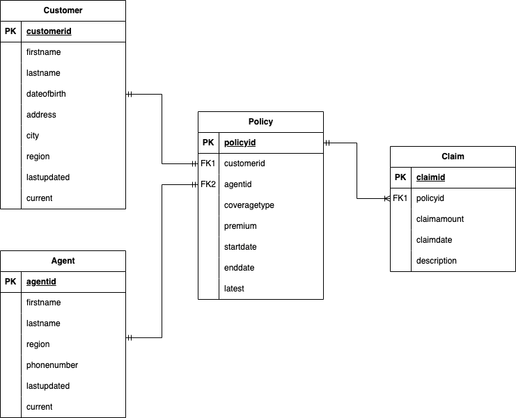

<h1 align="center">Delta Medallion Project</h1>

## Description
Delta Medallion Project is an ETL pipeline processing Slowly Changing Dimension Type 2 (SCD 2) dataset using Delta Lake, an open-source framework and Apache Spark written in Python. Goal of this project is to provide a reliable and scalable data lake solution, efficiently handling SCD 2 data type. \
\
Here are some key features from Delta Lake, Apache Spark, and Medallion Architecture implemented in this ETL project: 
1. ACID Transactions: Protect data with serializability and isolation
2. Scalable Metadata: Handle petabyte-scale tables with billions of partitions and files with ease
3. Time Travel: Access/revert to earlier versions of data for audits, rollbacks, or reproduce
4. DML Operations: Supports SQL, Scala/Java and Python APIs to merge(upsert function), update and delete datasets, while upsert function is especially useful for SCD2 datatype
5. Change Data Capture/Feed (CDC): tracks row-level changes between versions for all the data written into tables, which includes row data along with metadata whether the specified row was inserted, deleted, or updated 
6. Integration with Apache Spark: leverage Spark's speed and performance, scalability, and fault tolerance through resilient distributed datasets (RDDs)
7. Schema Evolution/Enforcement: Prevent bad data from causing data corruption
8. Medallion Architecture: Data design pattern used in a lakehouse, with the use of architecture (from Bronze ⇒ Silver ⇒ Gold layer tables) to perform incrementally improving structure to ensure the quality of data going through each layers


## Table Schema


## Prerequisites
* Python (using version 3.11.6 or newer)

## Installation
* Create your own virtual environment and [pip](https://pip.pypa.io/en/stable/) to install required libraries in requirement.txt (using Apache Spark version 3.5.0 which is compatible with Delta Lake 3.0.0)
```shell
pip install -r requirements.txt
```
## Setup
To run the ETL process, we are going to: 
1. Create delta table by running **create_delta_tables.py**
2. Initialize and merge/append data into delta tables by running **bronze.py**
3. Apply silver layer functions and insert data by running **silver.py**
4. Apply gold layer functions and insert data by running 2 python files, **gold_claim.py** and **gold_policy.py**

## Usage
Delta lake features can be demonstrated in **read_delta.py**, where Time Travel and Change Data Feed function can be used in the script.
